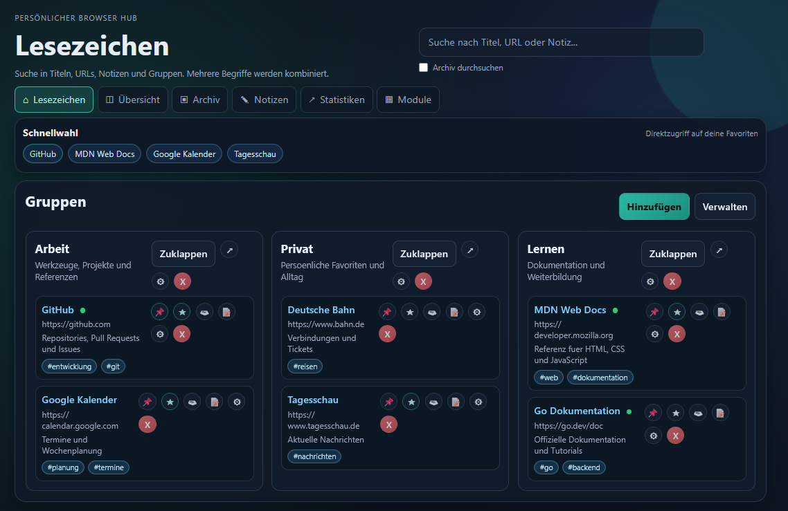
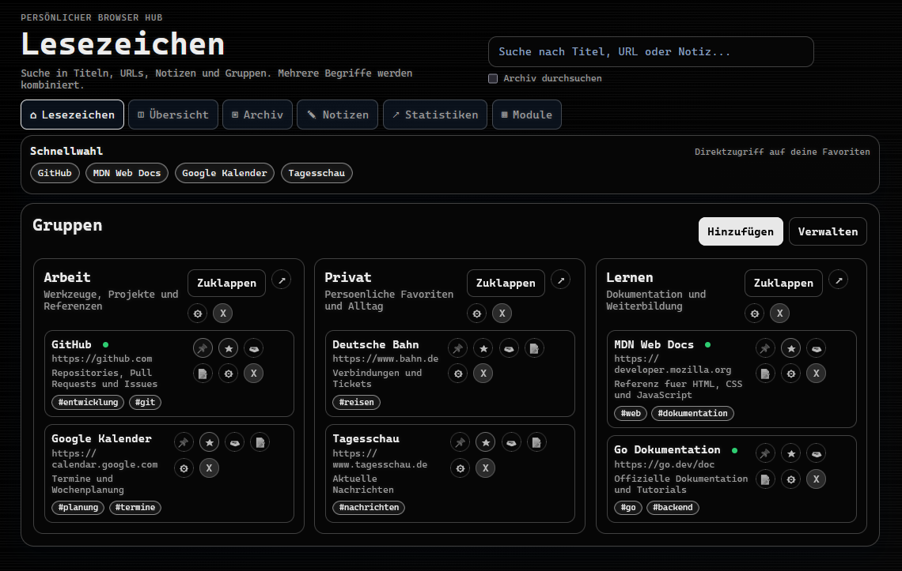

# Lesezeichen Hub

Moderner Bookmark-Hub als lokale Web-App mit Go und SQLite.

Die Anwendung laeuft komplett lokal, bietet Gruppen, Tags, Favoriten, Wiedervorlagen, Import/Export und eine kompakte Uebersichtsseite.



*Startansicht mit Beispielgruppen, Lesezeichen, Tags und Favoriten-Schnellwahl.*



*Dieselbe Ansicht im optionalen ASCII-Monitor-Design.*

## Highlights

- Gruppen fuer saubere Struktur
- Lesezeichen mit Titel, URL, Notiz, Tags und Datum
- Favoriten und angepinnte Eintraege
- Suche ueber Titel, URL, Notizen, Tags und Gruppen
- Schnellfilter fuer Gruppen, Tags, Favoriten, Pins und faellige Wiedervorlagen
- Gespeicherte Ansichten fuer wiederkehrende Suchen und Filter
- Drag and Drop Sortierung fuer Gruppen und Lesezeichen
- Import und Export als JSON, CSV und HTML
- Lokale SQLite-Datenbank
- Lokale Webanwendungen als Lesezeichen in bestehende Gruppen integrieren

## Schnellstart

Voraussetzung: Go 1.23 oder neuer

1. Abhaengigkeiten aufloesen

```bash
go mod tidy
```

2. Entwicklung starten

```bash
go run .
```

3. Im Browser oeffnen

http://127.0.0.1:2222

`go run .` nutzt standardmaessig Port `2222`. Die Windows-Klickstartskripte nutzen dagegen Port `3233`, damit der Startport dort direkt als Parameter angepasst werden kann.

## Lokale Module integrieren

Unter **Module** wird automatisch der öffentliche Modulkatalog der GitHub-Organisation `Lesezeichen-Hub` angezeigt. Ein Klick auf **Herunterladen & einrichten** lädt das Repository, richtet dessen statische Weboberfläche ein und legt in der Gruppe **Module** ein Start-Lesezeichen an. Bereits vorhandene Module sind im Katalog grün umrandet und können dort per **Aktualisieren** erneut aus dem Repository geladen werden. Heruntergeladene Module liegen standardmäßig im Ordner `modules`; mit `MODULES_PATH` kann ein anderer Installationsordner gesetzt werden.

Für die GitHub-API kann optional `GITHUB_TOKEN` gesetzt werden. Ohne Token verwendet der Hub das anonyme API-Kontingent und wechselt bei einem ausgeschöpften Rate Limit automatisch auf die öffentliche Repository-Seite der Organisation.

Über **Hinzufuegen > Lokales Modul** kann ein Ordner mit einer `index.html` eingebunden werden, zum Beispiel der Projektordner von `werkplan`. Nach der Auswahl einer bestehenden Gruppe kann der Ordner über den Windows-Dialog **Ordner waehlen** ausgesucht werden. Der Hub speichert den lokalen Ordner und erzeugt in der ausgewählten Gruppe ein Start-Lesezeichen.

Auf der Seite **Module** kann ausserdem eine statische Webapp aus einer externen Quelle geladen werden. Die URL kann direkt auf ein ZIP-Archiv oder auf ein GitHub-Repository zeigen; bei GitHub-Repository-URLs verwendet der Hub automatisch den ZIP-Download des `main`-Branches. GitHub-Branch-URLs wie `/tree/develop` werden ebenfalls erkannt. Im Archiv sucht der Hub nach einer `index.html` im Archiv-Root oder in `public`, `static` beziehungsweise `web`. Das Archiv wird nach `modules` beziehungsweise `MODULES_PATH` entpackt, unter `/modules/...` ausgeliefert und als Start-Lesezeichen in der Gruppe **Module** eingetragen. Die Quelle wird gespeichert, sodass externe Module spaeter ueber **Neu laden** erneut aus derselben Quelle installiert werden koennen.

Für jedes Modul können zusätzlich Notizen und Tags vergeben werden. Da ein Modul als normales Lesezeichen gespeichert wird, erscheint es automatisch in Suche, Favoriten, Tags, Exporten und Notizen. Wird ein Modul archiviert oder sein Lesezeichen gelöscht, kann es mit demselben Namen erneut angelegt werden; verwaiste oder archivierte Moduldefinitionen werden dabei wiederverwendet beziehungsweise reaktiviert.

Die Dateien werden über den Hub unter `/modules/...` ausgeliefert, sodass relative CSS-, JavaScript- und Bildpfade der lokalen Anwendung funktionieren.

Über **Module** in der Hauptnavigation lassen sich registrierte Module prüfen, umbenennen, mit einem neuen Ordner verbinden, aus dem Katalog aktualisieren und vollständig inklusive Start-Lesezeichen löschen. Der Katalog liest, sofern vorhanden, `version.json` eines Moduls direkt über `raw.githubusercontent.com`; dadurch wird für die Versionsanzeige kein GitHub-REST-API-Kontingent verbraucht. Bei Kataloginstallationen speichert der Hub die erkannte Version und markiert beim späteren Prüfen verfügbare Updates mit installierter und neuer Version. Module ohne Manifest bleiben nutzbar und werden als ohne Versionsangabe angezeigt. Aufgelöste Symlinks und Windows-Junctions dürfen den registrierten Modulordner bei der Dateiauslieferung nicht verlassen.

Der Server muss lokal unter Windows laufen und Zugriff auf den angegebenen Ordner haben. Änderungen an den Moduldateien werden beim nächsten Aufruf direkt verwendet.

## Windows Start und Stop per Klick

Nach dem Build kannst du den Hub ohne Terminal starten:

- start-lesezeichen.cmd startet den Server im Hintergrund und oeffnet den Browser
- stop-lesezeichen.cmd beendet den laufenden Server
- Die Logik liegt in start-lesezeichen.ps1 und stop-lesezeichen.ps1
- Laufzeitdateien landen in .runtime, damit der Projekt-Root sauber bleibt

Port anpassen:

- Standard-Port in start-lesezeichen.cmd: set "PORT=3233"
- Optional beim Start als Parameter: start-lesezeichen.cmd 2233
- Beim Portwechsel wird ein alter Prozess automatisch beendet und neu gestartet
- Nach Klickstart im Browser oeffnen: http://127.0.0.1:3233

## Webseite direkt aus Firefox speichern (Tampermonkey)

Wenn du Seiten aus dem Browser direkt in den Hub schreiben willst, kannst du das mit Tampermonkey nutzen.

Datei im Projekt:

- tampermonkey-lesezeichen-hub.user.js

Einrichtung:

1. In Firefox die Erweiterung Tampermonkey installieren.
2. In Tampermonkey ein neues Script anlegen.
3. Den Inhalt aus tampermonkey-lesezeichen-hub.user.js einfuegen und speichern.
4. Den Hub starten (Standard im Startskript: http://localhost:3233).

Nutzung:

- Tampermonkey-Menue: Im Lesezeichen-Hub speichern
- Tastenkombination: Alt+Shift+B
- Optional Hub-URL im Tampermonkey-Menue setzen, falls dein Port abweicht

Hinweise:

- Das Script fragt erst Gruppe, Titel, Notiz und Tags ab und sendet dann an /api/bookmarks.
- Der Speicherdialog merkt die zuletzt verwendete Gruppe und bietet bereits verwendete Tags als Vorschläge an.
- Wenn noch keine Gruppen existieren, zuerst im Hub eine Gruppe anlegen.

## EXE bauen

### Lokal

```bash
go build -trimpath -ldflags "-s -w" -o Lesezeichen-Hub.exe .
```

Danach die EXE direkt starten.

Hinweise:

- Web-Dateien sind per embed in der EXE enthalten
- Der Server bindet standardmaessig ausschliesslich an `127.0.0.1`.
- Port kann bei Bedarf per Umgebungsvariable gesetzt werden, z.B. `ADDR=127.0.0.1:2233`.

## Betrieb und Datenschutz

- SQLite verwendet WAL-Modus, einen Busy-Timeout und eine einzelne Verbindung, damit parallele Zugriffe zuverlaessig verarbeitet werden.
- Die Edelmetallpreise rufen externe Anbieter ab. Sie lassen sich beim Start abschalten:

```powershell
$env:ENABLE_EXTERNAL_PRICES = 'false'
.\Lesezeichen-Hub.exe
```

- Bei deaktivierter Option wird die Preisleiste ausgeblendet; alle Lesezeichen- und Notizdaten bleiben rein lokal.
- Start- und Stopskripte pruefen den EXE-Pfad des gespeicherten Prozesses, bevor sie einen laufenden Prozess beenden.

## Tastatur

- `/`: Suche fokussieren
- `N`: Dialog fuer ein neues Lesezeichen oeffnen
- `G`: Dialog fuer eine neue Gruppe oeffnen
- `Esc`: offenen Dialog schliessen

### GitHub Release Build

Ein Workflow unter .github/workflows/main.yml baut automatisch eine Windows-EXE bei einem veroeffentlichten Release.

Regel:

- Der Tag muss mit einer Zahl beginnen, z.B. 1.0.0 oder 1.2026.06

Ablauf:

1. Tag erstellen und pushen

```bash
git tag 1.0.0
git push origin 1.0.0
```

2. Release auf GitHub veroeffentlichen
3. Workflow erstellt und haengt das Asset an

Asset-Name:

- Lesezeichen-Hub_<Versionstag>.exe
- Lesezeichen-Hub_<Versionstag>.exe.sha256

### Update aus dem Hub

Der Hub kennt seine Version aus dem Release-Tag. Der GitHub-Workflow setzt sie beim Build mit `-X main.appVersion=<Tag>`.

In der Verwaltungsleiste kann der Hub nach Updates suchen. Dabei wird `version.json` vom Standardbranch des Repositorys über `raw.githubusercontent.com` geladen. Die Datei enthält Version, Download-URL und SHA256-Prüfsumme des neuesten Releases. Der Update-Check nutzt damit nicht das GitHub-REST-API-Kontingent. Ist eine neue Version verfuegbar, kann sie nach Bestaetigung heruntergeladen und installiert werden.

Ablauf:

1. Neue EXE aus dem Release herunterladen
2. SHA256-Datei pruefen, falls sie im Release vorhanden ist
3. laufende EXE stoppen
4. alte EXE durch die neue ersetzen
5. Hub mit derselben Adresse wieder starten

Die Update-Installation funktioniert nur unter Windows aus einer laufenden `.exe`. Beim Start per `go run .` ist nur die Update-Pruefung sinnvoll.

## Daten und Dateien

- Datenbank: data.db
- Laufzeitdateien: .runtime
- Installierte Module: modules (oder `MODULES_PATH`)
- Web-Frontend: web

## API Uebersicht

- GET /api/state
- GET /api/export
- POST /api/import
- GET /api/backup
- POST /api/restore
- GET /api/groups
- POST /api/groups
- PUT /api/groups/{id}
- DELETE /api/groups/{id}
- GET /api/groups/{id}/bookmarks
- POST /api/bookmarks
- PUT /api/bookmarks/{id}
- DELETE /api/bookmarks/{id}
- GET /api/modules
- POST /api/modules
- PUT /api/modules/{id}
- DELETE /api/modules/{id}
- GET /api/module-catalog
- POST /api/module-catalog/{repository}/install

Wiederherstellungen werden vor dem Einspielen mit `POST /api/restore?preview=1` geprüft. Der Assistent erstellt auf Wunsch zuerst eine neue Vollsicherung und unterstützt die Konfliktstrategien `overwrite` und `skip`.

Import-Hinweise:

- Speed Dial JSON mit dials wird in die Gruppe ungruppiert importiert
- Vorhandene Gruppen bleiben erhalten
- Der normale JSON-Import mit groups ist merge-basiert
- Bereits vorhandene Lesezeichen gleicher Gruppe plus URL werden nicht doppelt angelegt

## Troubleshooting

- Kein Zahnrad sichtbar: Seite mit Strg+F5 hart neu laden
- Falscher Port: Startskript auf 3233 pruefen oder Port als Parameter uebergeben
- Build nicht gefunden: Sicherstellen, dass Lesezeichen-Hub.exe im Projektordner liegt
